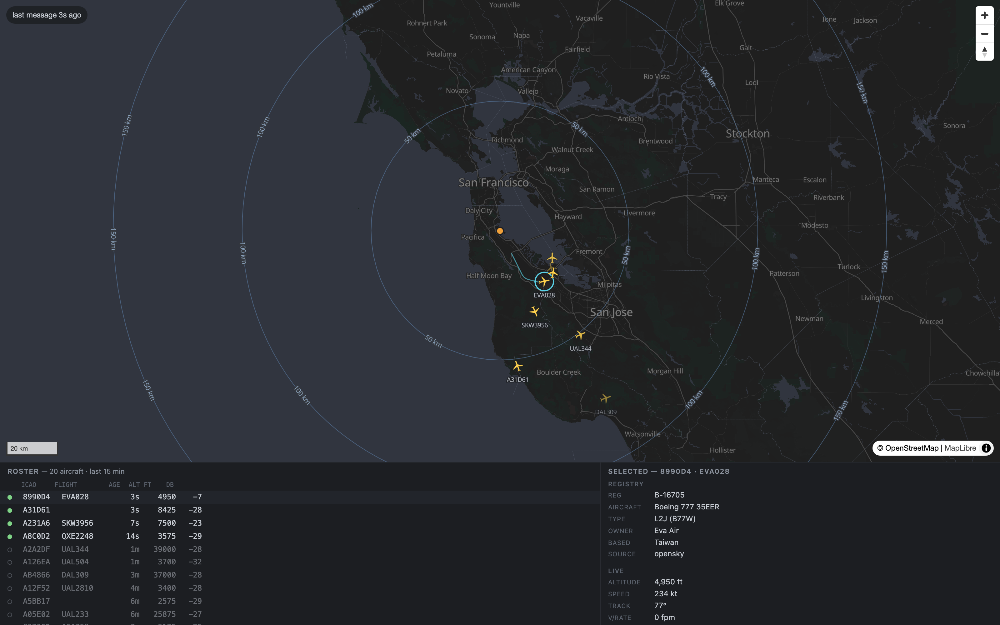
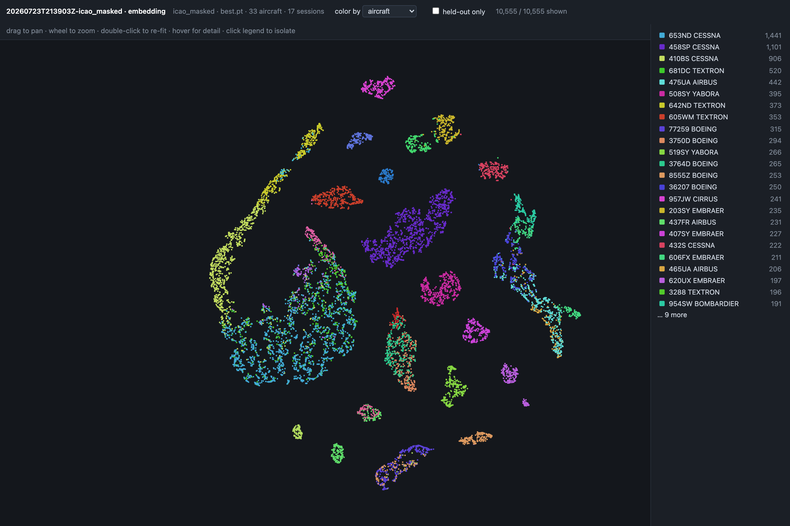

# adsb-fingerprint

RF fingerprinting of ADS-B transponders from RTL-SDR captures: identify the
*physical transmitter*, not the identity it claims. A toy implementation of the
idea in [US 2022/0217619 A1][patent] ("Artificial Intelligence Radio Classifier
and Identifier", BAE Systems), scaled to what an RTL2832U dongle can receive —
Mode S extended squitters at 1090 MHz.

Every ADS-B message carries the aircraft's 24-bit ICAO address: free ground
truth, thousands of labeled bursts per hour from a home antenna. The model
sees only raw IQ; the question is whether transponder hardware leaves enough
of a mark (oscillator offset, PA settling, clock skew) to identify the
airframe with the ID bits masked out, across receive geometries.

[patent]: https://patents.google.com/patent/US20220217619A1/en


*`adsb-web`, live over the collector's index: planes, range rings, the
recently-heard roster, and a registry-joined detail panel (here an EVA Air
777 over the South Bay). Receiver shown at the example-config placeholder.*

## The honest caveat (read first)

A fixed receiver cannot control aircraft geometry, so the easiest signal
correlated with ICAO is the propagation channel — range, SNR, multipath,
Doppler — not transponder hardware. A high in-session score most likely means
you built a "how far away" detector. The experimental design exists to
disprove that: splits hold out whole sessions (never random messages),
ablations mask the ID bits or keep only the fixed 8 µs preamble, and
channel-only baselines set the bar the model has to clear. A clean negative
result is a legitimate outcome. [doc/PLAN.md](doc/PLAN.md) is the design.

## Results so far (2026-07-23)

Corpus snapshot: 41k messages, 347 aircraft, 25 sessions, one receiver.
Supervised split: the 33 aircraft with enough cross-session data — 5,629
train / 4,926 test messages, with the last 5 sessions of the day held out
entirely. Balanced-accuracy chance is 1/33 ≈ 0.030.

| classifier          | input                    | accuracy | balanced |
|---------------------|--------------------------|---------:|---------:|
| ADCC, ICAO masked   | raw IQ, ID bits zeroed   |    0.744 |    0.656 |
| ADCC, whole message | raw IQ                   |    0.708 |    0.627 |
| cheap-features      | RSSI + SNR + CFO         |    0.487 |    0.330 |
| cfo-only            | carrier frequency offset |    0.504 |    0.321 |
| all-features        | all handcrafted features |    0.480 |    0.318 |
| ADCC, preamble only | first 8 µs of raw IQ     |    0.289 |    0.176 |
| channel-only        | RSSI + SNR               |    0.153 |    0.038 |

- **Masked ≥ whole** — the network is not just reading the ID field.
- **Channel-only ≈ chance** — cross-session identity is not a range detector.
- **Preamble-only ≫ chance** — 8 µs of waveform that every transponder
  transmits identically by spec still carries real identity.
- **The CNN doubles the best handcrafted baseline**, and CFO alone carries
  nearly all of the cheap-feature signal: crystals sit tens of kHz apart
  while one airframe holds within a few hundred Hz (between-/within-aircraft
  sd ratio ≈ 19). The full variance decomposition — and why the collector
  stores micro-clusters of 3 messages per 10 s — is in
  [doc/VARIANCE.md](doc/VARIANCE.md).

The open caveat: all of this is one day of data — the held-out sessions are
later the same day, not a different day. A held-out *day* is the next
experiment.

## How it works

1. **Collect** — `adsb-collect` streams the SDR, correlates the Mode S
   preamble, PPM-demodulates, keeps CRC-clean messages (pyModeS), and stores
   each burst's raw IQ (~288 complex samples at 2.4 MSPS) plus an index row.
2. **Label** — `adsb-ingest-faa` / `adsb-ingest-opensky` resolve ICAOs to
   registrations, types, and operators.
3. **Train** — `adsb-train` fits a rescaled Augmented Dilated Causal
   Convolution network (144k parameters) on IQ alone, whole sessions held
   out; `--variant` selects whole / icao_masked / preamble.
4. **Evaluate** — `adsb-eval` scores checkpoints on their held-out sessions
   and fits the feature baselines the model has to beat.
5. **Inspect** — `adsb-embed` projects a run's embedding space to 2-D with a
   k-NN purity report; `adsb-web` serves a live map of what's overhead.

The filesystem is the source of truth — raw IQ snippets in `.cf32` files;
Postgres is a rebuildable index over them (`adsb-index` regenerates it).

## Hardware

- Any RTL2832U SDR with an antenna that hears 1090 MHz. Developed on a
  Nooelec NESDR SMArt XTR (E4000 tuner, 8-bit, 2.4 MSPS); librtlsdr is
  bundled by `pyrtlsdr[lib]`, so there is no separate driver install.
- Training runs at ~1–2 s/epoch on Apple Silicon (PyTorch MPS); CPU works.
- Receive-only. ADS-B is an unencrypted broadcast intended for reception;
  nothing here transmits.

## Setup

Python ≥ 3.11, [uv](https://docs.astral.sh/uv/), PostgreSQL with PostGIS.
Postgres connects by local peer auth — `dbname` only, no credentials (`.env`
is reserved for future secrets).

```bash
uv sync
createdb radio_classifier
cp config.yaml.example config.yaml    # receiver location, paths, SDR settings
uv run adsb-initdb                    # applies sql/*.sql (incl. PostGIS layer)
uv run adsb-info                      # sanity-check the dongle
uv run adsb-collect                   # start collecting
uv run adsb-web                       # live map at http://127.0.0.1:5050
```

Registry data (optional — labels for the web UI and eval reports):

```bash
# FAA: unzip ReleasableAircraft.zip into data/ReleasableAircraft/, then
uv run adsb-ingest-faa
# OpenSky: put aircraft-database-complete-*.csv in data/, then
uv run adsb-ingest-opensky
```

The live map reads a local [PMTiles](https://github.com/protomaps/PMTiles)
basemap (`map.tiles_file` in config) — grab an area extract from
[Protomaps builds](https://maps.protomaps.com/builds/) once; the UI never
fetches tiles from the network.

## Commands

| command               | does                                                          |
|-----------------------|---------------------------------------------------------------|
| `adsb-info`           | print RTL-SDR device details and the configured capture target |
| `adsb-initdb`         | apply `sql/` to the configured Postgres database              |
| `adsb-collect`        | stream the SDR, persist only detected Mode S message snippets |
| `adsb-capture`        | stream raw IQ into timestamped `.cf32` files (bulk alternative) |
| `adsb-index`          | (re)detect messages in captures and fill the index            |
| `adsb-ingest-faa`     | load the FAA Releasable Aircraft registry                     |
| `adsb-ingest-opensky` | load the OpenSky aircraft database CSV                        |
| `adsb-stats`          | summarize the database                                        |
| `adsb-dataset`        | summarize the fingerprinting dataset built from the index     |
| `adsb-train`          | train the ADCC model with whole sessions held out             |
| `adsb-eval`           | cross-session evaluation, ablation comparison, baselines      |
| `adsb-embed`          | write a self-contained embedding viewer into a run directory  |
| `adsb-variance`       | decompose feature variance (message / window / session)       |
| `adsb-web`            | live map, roster, detail panel, and embedding viewers         |

## Web UI

`adsb-web` is a dark live map over the same Postgres index the collector
writes: aircraft with range rings and staleness fade, a recently-heard
roster, and a detail panel joining registry data with live state and radio
stats (message rate, sessions seen, RSSI sparkline). All spatial math is
PostGIS; the browser only draws what the API hands it. `/embeddings` lists
training runs and serves each one's self-contained embedding viewer. Design
notes: [doc/WEBUI.md](doc/WEBUI.md).


*The embedding viewer for an ICAO-masked run: one point per message (10.5k
shown), t-SNE of the model's 48-dim penultimate embedding, colored by
airframe — the clusters are airframes, not channels.*

## Documentation

- [doc/PLAN.md](doc/PLAN.md) — design, signal facts, experimental protocol
- [doc/VARIANCE.md](doc/VARIANCE.md) — variance decomposition, the CFO
  estimator, sampling policy
- [doc/WEBUI.md](doc/WEBUI.md) — web UI design
- [doc/US-20220217619-A1_I.pdf](doc/US-20220217619-A1_I.pdf) — the published
  patent application this project rescales

## Data sources & third-party

- [FAA Releasable Aircraft registry](https://www.faa.gov/licenses_certificates/aircraft_certification/aircraft_registry/releasable_aircraft_download)
  (US public record; only registrant names are stored, no street addresses)
- [OpenSky aircraft database](https://opensky-network.org/aircraft-database)
  (their terms apply)
- Vendored map stack: [MapLibre GL JS](https://maplibre.org/) (BSD-3),
  [PMTiles](https://github.com/protomaps/PMTiles) (BSD-3),
  [Protomaps basemaps](https://github.com/protomaps/basemaps) theme and
  sprite assets, Noto Sans glyphs (SIL OFL). Basemap data ©
  [OpenStreetMap](https://www.openstreetmap.org/copyright) contributors.

## License

MIT — see [LICENSE](LICENSE). Note that
[pyModeS](https://github.com/junzis/pyModeS) (CRC + message decoding) is
GPL-3.0, so a distribution that bundles dependencies is governed by its
terms.
